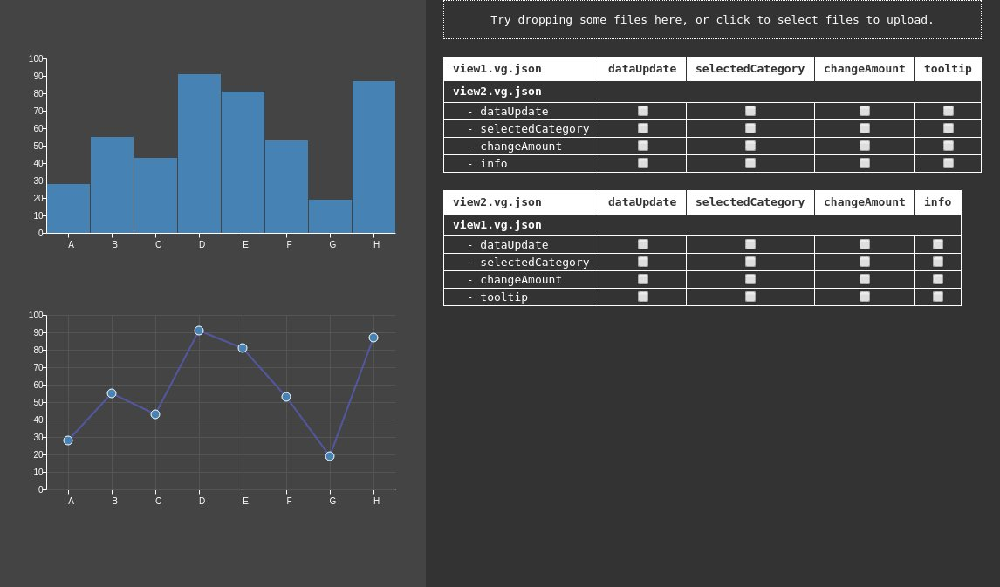

## Setting up interaction between Vega3 views in separate div elements

This is an attempt to improve [bigdator3](https://github.com/abudaan/bigdator3). You might want to read the [README](https://github.com/abudaan/bigdator3/blob/master/README.md) of this project first to get acquainted to the problem this project seeks to solve.

In this app you can upload your own Vega specs at will. The data of your specs should either be:

1. included in the spec
2. referenced with a global url (e.g. `"src"="http://global.url/data.json"`)
3. referenced with a local url to the same folder (e.g. `"src"="data.json"`)

If you use the 3rd option you can simply upload your data json together with the spec, but you can upload the data before or afterwards as well.

This means that if you for instance upload `spec1` that uses `data.json` and later you decide to upload another spec that uses the same data, the app will automatically use the already uploaded data.

As soon as you have uploaded 2 specs that have signals defined, a "patch board" appears that allows you to connect a signal from one spec to a signal in another spec.

### Installation and running the project

You need to have git, nodejs and yarn (or npm) installed on your computer.

- clone the repository
- `yarn install` (or `npm install`)
- `yarn start` (or `npm start`)

The `yarn start` command will build the necessary js and css files and start a server on `http://localhost:5004`. If you don't want to go through all the hassle of installing, here is the [live version](https://abudaan.github.io/bigdator4).
